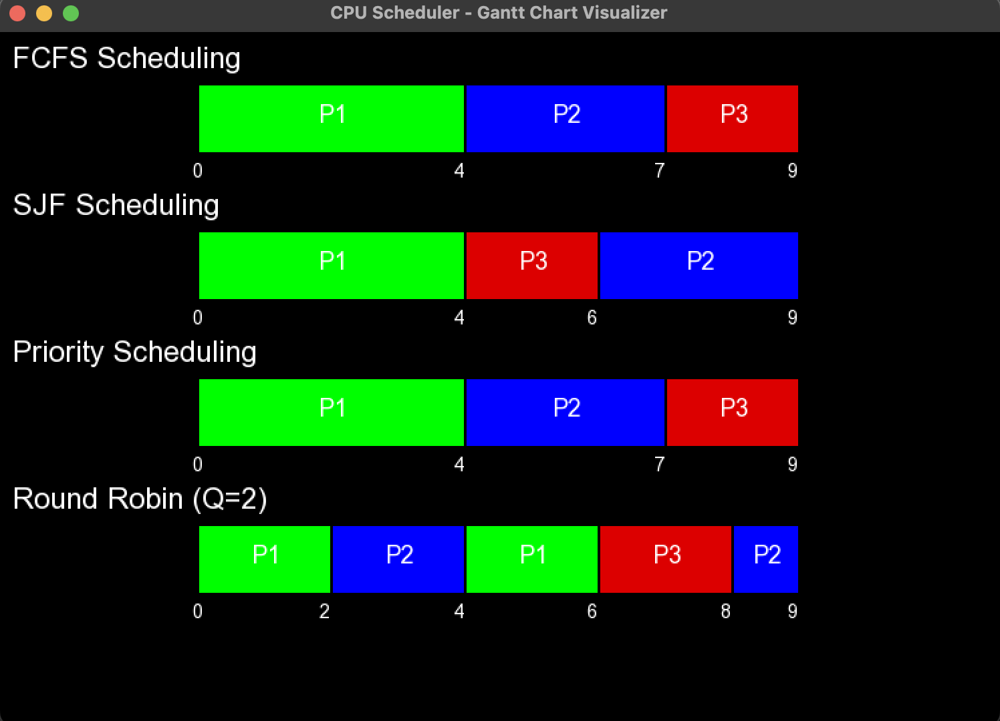
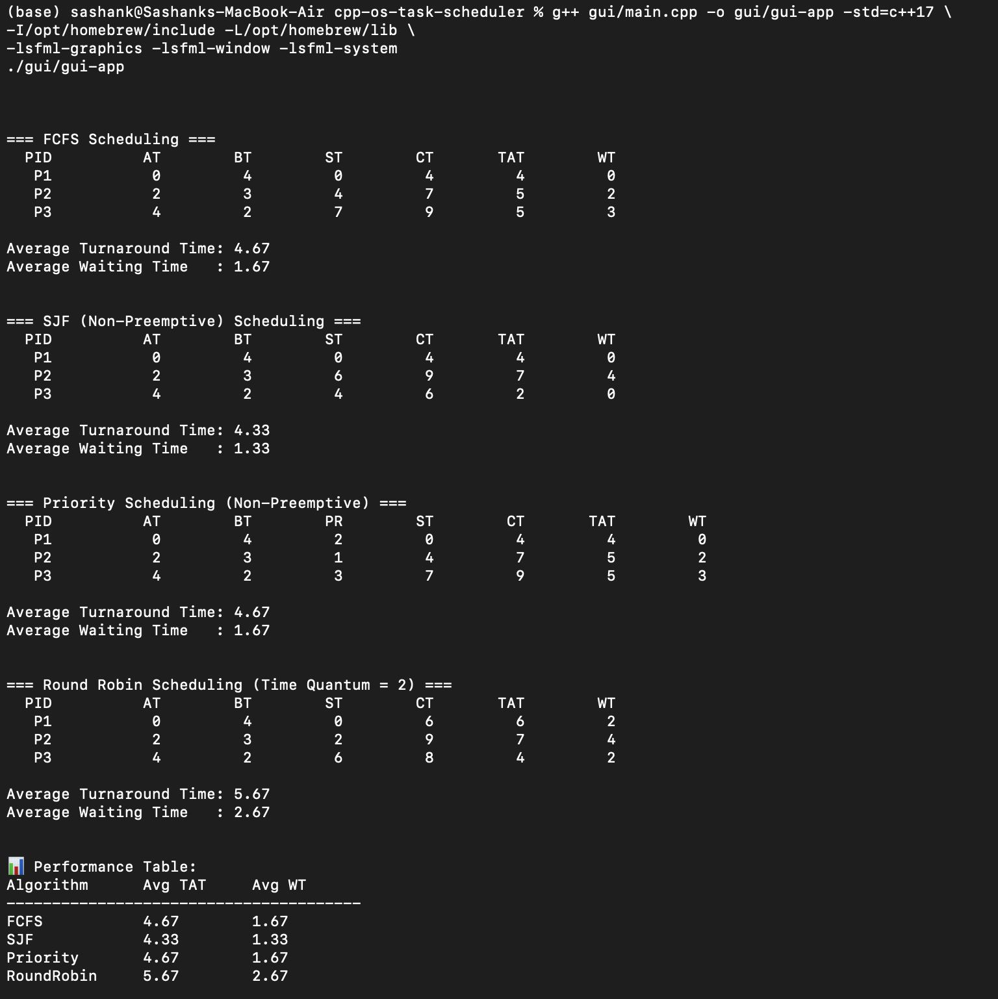

—>CPU Task Scheduler – CLI + GUI (C++ SFML)

This project simulates four CPU scheduling algorithms and visualizes them using a **C++ GUI built with SFML**. It’s designed for system-level understanding and placement-focused OS learning.

—> Features

FCFS, SJF, Priority, and Round Robin  
Input from `input.txt`  
CLI outputs process table with TAT, WT, CT  
FML GUI shows Gantt charts  
Written in pure C++ with modular architecture  
One-run execution: shows both performance table + chart

—>Screenshots

—>Visual Gantt Chart (SFML GUI)

—> Performance Metrics in Terminal (CLI)

---

—> Project Structure

